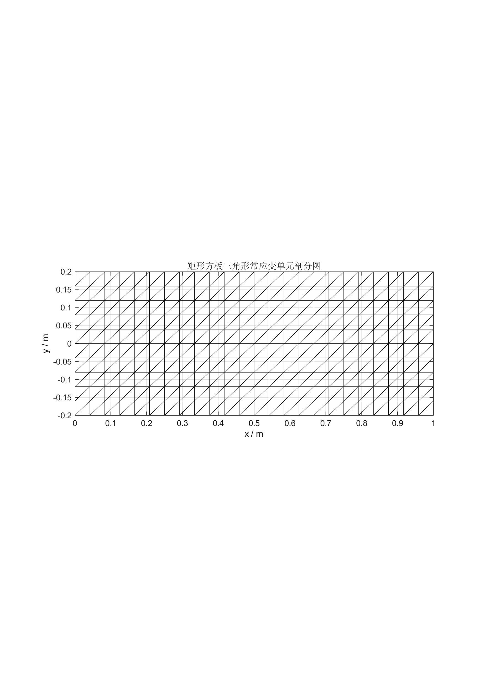
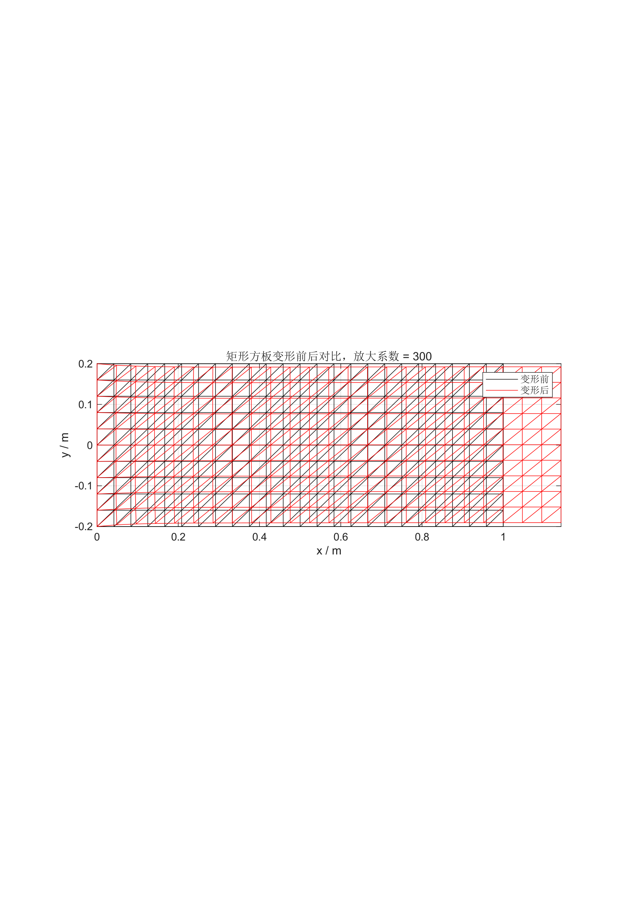

# Finite Element & Structural Simulation Archive

> A complete, evidence-oriented archive of finite-element coursework, structural mechanics scripts, Abaqus models, MATLAB implementations, numerical results, reports, and publication-style figures.

[](https://www.3ds.com/products/simulia/abaqus)
[](https://www.mathworks.com/products/matlab.html)
[](https://www.python.org/)
[](https://www.r-project.org/)
[](https://satoru-1006.github.io/finite-element-structural-simulation/)

## Project in one sentence

This repository records a progressive finite-element workflow—from one-dimensional bar and truss formulations to beam, frame, and two-dimensional plane-stress plate analyses—while preserving the models, scripts, solver outputs, tabulated results, reports, figures, and intermediate publication revisions that make the work auditable.

中文概述：这是一个完整的有限元分析与结构仿真研究档案，保留从一维杆单元、二维桁架、梁/悬臂梁、空间框架到二维平面应力矩形薄板的建模、求解、后处理、报告和科研图表。仓库不是只展示最终图片，而是尽可能保留从输入模型到结果解释的全链路证据。

## Featured result

The most complete research-style case is Task 9: a rectangular plate under tensile loading, modelled with three-node constant-strain triangular elements (CPS3) and compared against the uniform-tension theoretical solution.

<p align="center">
  
  
</p>

| Quantity | Saved project value |
|---|---:|
| Plate geometry | 1.0 m × 0.4 m × 0.01 m |
| Material model | Linear elastic, isotropic; E = 210 GPa, ν = 0.30 |
| Loading | Right-edge tensile traction q = 100 MPa |
| Element / analysis | CPS3; Static General, plane stress |
| Mesh | 189 nodes, 320 elements |
| Equivalent resultant force | 400,000.00596 N vs 400,000 N expected |
| Right-edge U1 error | 0.599% against the saved theoretical value |
| Mid-region S11 error | 0.179% against the saved theoretical value |

These values are transcribed from `task9/results_summary.json`. They describe the saved numerical model and its comparison baseline; they are not a claim of experimental or production validation.

## Research questions and evidence chain

The archive is organized around a repeatable mechanics workflow:

1. Define the continuum problem, geometry, material, load and boundary conditions.
2. Derive the weak form or element equations.
3. Discretize the structure and assemble the global stiffness system.
4. Apply displacement constraints and equivalent nodal loads.
5. Solve for nodal displacements and recover strains, stresses, reactions and internal forces.
6. Compare the numerical result with an analytical or theoretical reference.
7. Preserve the actual input files, solver outputs, post-processing data, figures and written interpretation.

The central Task 9 interpretation is that the CST model captures the global uniaxial-tension response well, while fixed-end constraints, low-order interpolation and a finite mesh create local transverse/shear stress perturbations near the constrained boundary. This interpretation is grounded in the saved manuscript, JSON summary, CSV results and figures in `task9/output/`.

## Study map

| Section | Focus | Main artefacts |
|---|---|---|
| `任务1&2/` | Problem identification and introductory one-dimensional FEM | PDFs, DOCX reports and worked solutions |
| `任务3/` | One-dimensional bar element formulation and MATLAB implementations | `.m` programs, reports and derivation material |
| `任务4/` | Two-dimensional truss analysis and Abaqus cross-check | MATLAB scripts, Abaqus Python automation, reports and archives |
| `task5/` | Beam / cantilever structural analysis | `.cae`, `.odb`, `.inp`, solver logs and reports |
| `task6/` | Element discretization and result comparison studies | 1/2/4/8-element Abaqus cases, tables, figures and reports |
| `task7/` | Two-element axial-bar Abaqus case | `.cae`, `.odb`, `.inp`, result summary and teaching material |
| `任务8/` | Rectangular plate plane-elasticity report and publication-style figures | MATLAB source, CSV fields, SVG/PDF/PNG figures, DOCX/PDF revisions |
| `task9/` | CST rectangular plate tension; theory, MATLAB and Abaqus comparison | Abaqus model script, `.cae/.odb/.inp`, CSV/JSON results, R/Python figure pipelines and manuscripts |
| `有限元/` | Additional finite-element study notes and reports | Course documents and reference material |

## What is preserved

This public archive intentionally retains the project’s research trail, including:

- Abaqus model databases (`.cae`), output databases (`.odb`), input decks (`.inp`) and solver traces (`.dat`, `.msg`, `.sta`, `.log`, `.com`, `.ipm`, `.prt`, `.jnl`);
- MATLAB scripts for element matrices, global assembly, boundary conditions, displacement recovery, stress recovery and theory comparison;
- Python automation for Abaqus/CAE model creation, meshing, submission, field-output extraction and export;
- R and Python scripts for publication-style figures and report assembly;
- CSV, JSON and TXT source/result data;
- PDF, DOCX and rendered figure versions, including multiple revisions where the original archive contained them;
- PNG, SVG and TIFF figures for meshes, displacement fields, deformed shapes, stress components and error/source comparisons;
- original compressed course packages (`.zip`, `.7z`) that were present in the source archive.

The duplicate-looking report versions are retained on purpose: they document the evolution from source report to formula-corrected, two-column and publication-style layouts.

## Reproduction guide

### MATLAB

Open the relevant `.m` file in MATLAB and run it with the project directory as the working folder. The most complete standalone plate workflow is:

```matlab
run('task9/untitled9.m')
```

The MATLAB scripts generate nodal displacement, element stress and result figures for the analytical comparison workflow. The exact numerical values already exported from the original run are retained in `task9/` and `task9/output/`.

### Abaqus/CAE

The Task 9 no-GUI automation entry point is:

```text
abaqus cae noGUI=task9/task9_abaqus_model.py
```

The script builds the rectangular plate, creates the CPS3 mesh, applies the plane-stress material and loading, submits the static analysis, exports CSV/JSON results and writes figures. Abaqus licensing and the local Abaqus Python environment are required. Some legacy scripts contain the original Windows absolute paths; update those paths for a different machine before running.

### R figures

The R figure pipeline is preserved under `task9/output/`. It expects the saved CSV/JSON results and the R packages declared in the script. The generated SVG, TIFF and PNG outputs are already included, so the repository remains useful even on machines without the original R environment.

## Reading the evidence correctly

The repository distinguishes between:

- a solver input or script and a completed solver run;
- a saved numerical result and an analytical/theoretical comparison;
- a publication figure and an independent experimental measurement;
- a course/report artifact and a manufacturing or safety qualification.

The results here are finite-element and structural-mechanics computations. They should not be interpreted as physical test certification, production design approval, fatigue-life certification, or safety validation unless an independent test and review process is added.

## Public release boundary

The source project was archived as a public research showcase. Project files, solver models, source code, reports, results and figures are included. Two local-machine artifacts were deliberately withheld because they are not research evidence and are unsafe or inappropriate as public repository content:

- `task6/tsk6.3/ExampleC_SpaceFrame_SFSM.env` — a local Abaqus/environment snapshot containing machine paths and runtime state;
- `task9/output/R-4.6.0-win.exe` — the R for Windows installer, not part of the finite-element model or result chain.

No finite-element video was found in the source project or the searched Desktop project archive. The showcase therefore uses the two verified result figures above as the hero visuals instead of inserting an unrelated video or fabricating a video frame.

## Citation

If you use this archive in teaching, a report or a research note, cite the repository using [`CITATION.cff`](CITATION.cff). The repository’s visual showcase is available at:

**<https://satoru-1006.github.io/finite-element-structural-simulation/>**

## Author and status

Maintained by **Satoru-1006** as an auditable finite-element and structural-simulation research archive. The repository is a study and computation record; it is not presented as a peer-reviewed publication or a hardware qualification package.

